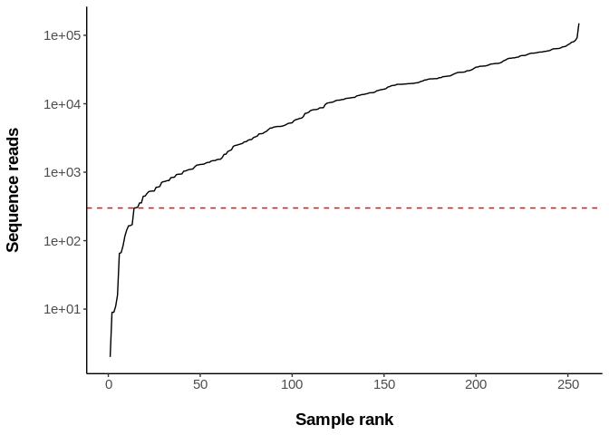
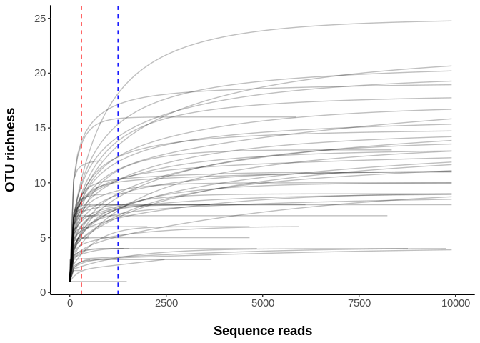
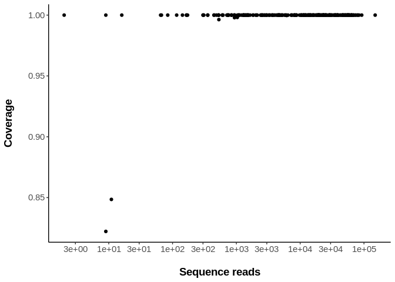
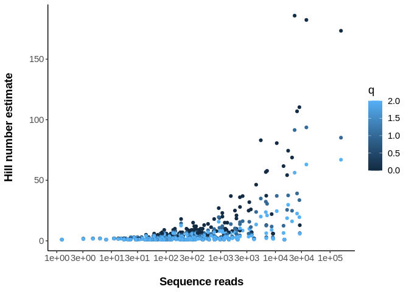

Rarefaction and alpha-diversity
================
Kyle A. Gervers
2023-04-17

# Sections

- [Introduction](#introduction)
- [Installation](#installation)
- [Demonstration](#demonstration)

## Introduction

[Return](#sections)

Coming soon…

## Installation

[Return](#sections)

Install these prerequisites beforehand

    # Git ####
    git version 2.40.0


    # GitHub CLI ####
    gh version 2.27.0 (2023-04-07)
    https://github.com/cli/cli/releases/tag/v2.27.0


    # Conda ####
    conda 23.3.1

The following package dependencies were installed and managed with
`conda`

    name: /home/gerverska/projects/rarefy-demo/env
    channels:
      - conda-forge
      - bioconda
      - defaults
    dependencies:
      - bioconductor-phyloseq
      - r-markdown
      - r-remotes
      - r-rmarkdown
      - r-tidyverse
      - r-vegan
    prefix: /home/gerverska/projects/rarefy-demo/env

Install this environment from `config.yml` using the `build.sh` script,
included in the `rarefy-demo` repo. **Run on the command line; the code
block won’t produce any output when run from within README.rmd.**

``` bash
# Clone the repository ####
gh repo clone gerverska/rarefy-demo

# Change directory to the repo ####
cd rarefy-demo

# Run the build script ####
bash code/build.sh
```

Activate the environment and `rstudio` from the command line after
building

    conda activate env

    rstudio

## Demonstration

[Return](#sections)

- [Load packages and set
  directories](#load-packages-and-set-directories)
- [Make a phyloseq object](#make-a-phyloseq-object)
- [Rarefy a phyloseq object](#rarefy-a-phyloseq-object)
- [Using iNEXT](#using-inext)

### Load packages and set directories

[Return](#Demonstration)

After opening this `README.rmd` in RStudio, I’ll install and load the R
packages I’ll need by running the code block below

``` r
# Install iNEXT from GitHub ####
remotes::install_github('gerverska/iNEXT@v1.0.0', dependencies = F)

# Load other packages ####
library(iNEXT)
library(Biostrings)
library(phyloseq)
library(vegan)
library(tidyverse)

# Set and make input and output directories ####
in.path <- 'data'
out <- 'rarefy'
logs <- file.path(out, 'logs')
```

### Make a phyloseq object

[Return](#Demonstration)

`phyloseq` is an R package that lets me combine all the data relevant
for my metabarcoding project (e.g., sample metadata, a sample x OTU
table, an OTU x taxonomy table, an OTU x sequence table, etc.) into a
single `phyloseq` object. This is handy for when I want to filter
certain samples or OTUs and have those changes reflected in all the
other tables. From here, a lot of common analyses and figures can be
produced. However, I often find that using `phyloseq` alone often leaves
a lot to be desired, especially once my analyses get a little more
developed. We can always pull a `phyloseq` component out, work on it,
and put it back into the `phyloseq` object.

To make a `phyloseq` object, I’ll need to produce and load some input
tables.

``` r
# Note that some tables are converted into matrices upon being read ! ####

# Sample metadata (rows = samples, columns = variables for each sample) ####
sam.data <- read.csv(file.path('data', 'sam-data.csv'), row.names = 1)
str(sam.data)
```

    'data.frame':   256 obs. of  5 variables:
     $ id     : chr  "P01_01_A" "P01_01_B" "P01_01_C" "P01_01_D" ...
     $ height : num  24 24 24 24 31.5 31.5 31.5 31.5 36.5 36.5 ...
     $ age    : chr  "A1" "A2" "A3" "A4" ...
     $ tree   : chr  "BIRD348" "BIRD348" "BIRD348" "BIRD348" ...
     $ closure: num  20.2 20.2 20.2 20.2 17.9 ...

``` r
# Sample by OTU table (rows = samples, columns = OTU reads for each sample) ####
otu.tab <- read.csv(file.path('data', 'otu-tab.csv'), row.names = 1) |> as.matrix()
str(otu.tab, list.len = 10)
```

     int [1:256, 1:218] 8 1605 39 26518 86 139854 71570 8 0 11577 ...
     - attr(*, "dimnames")=List of 2
      ..$ : chr [1:256] "P01_01_A" "P01_01_B" "P01_01_C" "P01_01_D" ...
      ..$ : chr [1:218] "OTU.1" "OTU.2" "OTU.3" "OTU.4" ...

``` r
# OTU by taxonomy table (rows = OTUs, columns = taxonomic ranks for each OTU) ####
tax.tab <- read.csv(file.path('data', 'tax-tab.csv'), row.names = 1) |> as.matrix()
str(tax.tab)
```

     chr [1:218, 1:8] "Fungi" "Fungi" "Fungi" "Fungi" "Fungi" "Fungi" "Fungi" ...
     - attr(*, "dimnames")=List of 2
      ..$ : chr [1:218] "OTU.1" "OTU.2" "OTU.3" "OTU.4" ...
      ..$ : chr [1:8] "Kingdom" "Phylum" "Class" "Order" ...

``` r
# OTU by sequence table (rows = OTUs, column = the sequence representing each OTU) ####
# readDNAStringSet() comes from the Biostrings package, and allows FASTA files to be read in ####
ref.seq <- readDNAStringSet(file.path('data', 'ref-seq.fa'))
str(ref.seq)
```

    Formal class 'DNAStringSet' [package "Biostrings"] with 5 slots
      ..@ pool           :Formal class 'SharedRaw_Pool' [package "XVector"] with 2 slots
      .. .. ..@ xp_list                    :List of 1
      .. .. .. ..$ :<externalptr> 
      .. .. ..@ .link_to_cached_object_list:List of 1
      .. .. .. ..$ :<environment: 0x55ac5646adc0> 
      ..@ ranges         :Formal class 'GroupedIRanges' [package "XVector"] with 7 slots
      .. .. ..@ group          : int [1:218] 1 1 1 1 1 1 1 1 1 1 ...
      .. .. ..@ start          : int [1:218] 1 140 288 435 581 728 900 1045 1191 1352 ...
      .. .. ..@ width          : int [1:218] 139 148 147 146 147 172 145 146 161 149 ...
      .. .. ..@ NAMES          : chr [1:218] "OTU.1" "OTU.2" "OTU.3" "OTU.4" ...
      .. .. ..@ elementType    : chr "ANY"
      .. .. ..@ elementMetadata: NULL
      .. .. ..@ metadata       : list()
      ..@ elementType    : chr "DNAString"
      ..@ elementMetadata: NULL
      ..@ metadata       : list()

The input data shown here has already undergone sample and OTU filtering
(i.e., controls have been removed, and OTUs mostly found in negative
controls have been removed). `phyloseq` has
[functions](https://joey711.github.io/phyloseq/preprocess.html) that can
help trim away these samples and OTUs, but there are many ways in which
this can be done.

I’ll need to use a separate `phyloseq` function to create each component
of the `phyloseq` object.

``` r
# Converted each input before combining them into a phyloseq object with phyloseq()
phy <- phyloseq(sam.data |> sample_data(),
                otu.tab |> otu_table(taxa_are_rows = F),
                tax.tab |> tax_table(),
                ref.seq |> refseq()
                )
```

### Rarefy a phyloseq object

From the “Help” entry for the `phyloseq` function `rarefy_even_depth()`
(emphasis added)

> This approach is sometimes mistakenly called **“rarefaction”**, which
> in physics refers to a form of wave decompression; but in this
> context, ecology, the term refers to a **repeated sampling procedure
> to assess species richness**, first proposed in 1968 by Howard
> Sanders. **In contrast, the procedure implemented here is used as an
> *ad hoc* means to normalize microbiome counts that have resulted from
> libraries of widely-differing sizes.** Here we have intentionally
> adopted an alternative name, **rarefy, that has also been used
> recently to describe this process** and, to our knowledge, not
> previously used in ecology.

Unfortunately, as hinted at in this excerpt, “rarefying” and
“rarefaction” have a complicated history. While *rarefying* is probably
[a bad idea](#https://doi.org/10.1371/journal.pcbi.1003531),
*rarefaction* as a means to estimate alpha-diversity metrics has more of
a foundation. However, I think McMurdie and Holmes’ use of “rarefy” has
only made things more confusing for the field.

#### Why would I want to normalize read counts across samples with different sequencing depth?

Because these differences are the result of methodological artifacts
(all the way from extraction and during sequencing itself) that can
affect our estimates of alpha-diversity and beta-diversity. Samples with
more reads are likely to appear richer than samples with fewer reads,
and samples with many reads have a higher chance of looking similar to
other well sequenced samples. Altogether, these differences can distort
the perception of the underlying ecological reality. This is largely
because well sequenced samples have greater **coverage** than poorly
sequenced samples. That is, well sequenced samples likely capture more
complete ecological pictures (coverage = sample completeness).

The method described for `rarefy_even_depth()` is an imperfect way of
fixing the coverage problem, mainly because it represents a single
sub-sampling of the OTU table (throwing away a lot of data), but also
because it focuses on sequencing depth, **which is related to but
distinct from coverage**. Nevertheless, this approach is still commonly
applied, and relies on the analyst picking a sequencing depth that both
**(1)** retains an acceptable number of samples and **(2)** marks the
point at which further sampling begins to detect fewer new OTUs. If a
sample has fewer reads than this final depth, it is dropped from all
subsequent calculations.

I’ll first try to find a depth that lets me keep most of my samples, but
still removes samples that might be under-sequenced relative to the
majority of the sample set. To borrow some language from calculus, I’ll
be looking for an “inflection point” in sequencing depth.

``` r
# Examine sequencing depth across all samples ####
read.ranks <- otu.tab |>
    rowSums() |> sort() |> # Sort the depths from least to greatest
    data.frame(reads = _) %>%
    mutate(rank = 1:nrow(.), # Add a rank column (1 = least, 256 = greatest)
           prop = rank / nrow(.)) # And add a column that shows the proportion of samples represented by this rank

# Plot the ranked reads on a log scale to identify an obvious cutoff threshold ####
ggplot(read.ranks, aes(x = rank, y = reads)) +
    geom_line() +
    geom_hline(yintercept = 300, # This number is where this curve begins to flatten out
               color = 'red',
               linetype = 'dashed') +
    scale_x_continuous(n.breaks = 6) +
    scale_y_log10() +
    xlab("\nSample rank") +
    ylab("Sequence reads\n") +
    theme_classic() +
    theme(text = element_text(size = 14),
          axis.title.x = element_text(face = 'bold'),
          axis.title.y = element_text(face = 'bold'))
```

<!-- -->

While 300 reads is pretty low, I’m still able to retain \~95% of my
samples.

However, the issue with using 300 reads as target depth for rarefying
will emerge soon. I’ll use the `rarecurve()` function from the `vegan` R
package to find the sequencing depth at which I stop finding large
increases in the number of OTUs detected. This process uses true
rarefaction to estimate OTU richness for each sample.

1.  Start at the first value of `step` (10 in the below example)
2.  Randomly select a number of reads from the sample equal to `step`
    and calculate the OTU richness of the sample
3.  Repeat (2) a number of times equal to the `sample` argument of
    `rarecurve()`
4.  Take the average of all richness calculations. This is done for all
    samples with at least `step` = 10 reads.
5.  Increase the read depth by units of `step` and repeat steps 1-4
    until the original sequencing depth of each sample is reached.
6.  I now have a rarefaction curve for each sample!

``` r
# Generate rarefaction curves for each sample ####
curves <- rarecurve(otu.tab,
                    step = 100, # Every 100 reads...
                    sample = 100, # ...randomly select reads 1000 times to calculate an average for each sample
                    label = F,
                    tidy = T)

# Randomly sample groups to make the plot a little clearer ####
set.seed(666) # Make the random selection reproducible
samps <- levels(curves$Site) |> sample(64) # Randomly select 1/4th of samples
sub.curves <- curves |> filter(Site %in% samps) # Subset the rarefaction curves


# Plot the rarefaction curves for the subset of selected samples ####
ggplot(sub.curves, aes(x = Sample, y = Species, group = Site)) +
    geom_line(alpha = 0.25) + # This makes it easier for us to see each curve, too
    geom_vline(xintercept = 300,
               color = 'red',
               linetype = 'dashed') +
    geom_vline(xintercept = 1250,
               color = 'blue',
               linetype = 'dashed') +
    xlim(c(0, 10000)) +
    xlab("\nSequence reads") +
    ylab("OTU richness\n") +
    theme_classic() +
    theme(text = element_text(size = 14),
          axis.title.x = element_text(face = 'bold'),
          axis.title.y = element_text(face = 'bold'))
```

<!-- --> While variation
definitely exists, it unfortunately looks like the rarefaction curves
for a majority of samples don’t really begin to flatten out until
read/sequencing depth reaches \~1250 reads. However, if I were to filter
at this level, I’d only retain \~ 80% of my samples. For the purposes of
this exercise, assume that I’m okay with losing this many samples.

I’ll now “rarefy” according to `rarefy_even_depth()`. It’s important to
set `replace = F` in order for the result to even make some kind of
sense.

``` r
# "Rarefy" with phyloseq ####
rare.phy <- phy |> rarefy_even_depth(sample.size = 1250,
                                     rngseed = 666, # For reproducibility
                                     replace = F
                                     )
```

    `set.seed(666)` was used to initialize repeatable random subsampling.

    Please record this for your records so others can reproduce.

    Try `set.seed(666); .Random.seed` for the full vector

    ...

    47 samples removedbecause they contained fewer reads than `sample.size`.

    Up to first five removed samples are: 

    P01_01_AP01_02_EP01_03_AP01_04_AP01_04_E

    ...

    14OTUs were removed because they are no longer 
    present in any sample after random subsampling

    ...

Like I said, this approach is still somewhat common in the literature.
While pretty easy to implement, it has some pretty obvious limitations.
To demonstrate this, I’ll compare the total read counts before and after
rarefying.

``` r
# Get a vector of samples, each with the same sequencing depth ####
after <- rare.phy@otu_table |>
    as.data.frame() |>
    rowSums()

# Make sure that we're comparing the same samlpes before and after ####
before <- otu.tab[rownames(otu.tab) %in% names(after), ] |>
    rowSums() |> sort()

# Make a dataframe to plot with ####
reads <- data.frame(rank = 1:length(before),
                    before = before,
                    after = after)

# Plot the comparison ####
ggplot(reads, aes(x = rank)) +
    geom_line(aes(y = before)) +
    geom_line(aes(y = after)) +
    scale_y_continuous(n.breaks = 8) +
    xlab("\nSample rank") +
    ylab("Sequence reads\n") +
    theme_classic() +
    theme(text = element_text(size = 14),
          axis.title.x = element_text(face = 'bold'),
          axis.title.y = element_text(face = 'bold'))
```

<!-- -->

``` r
# Proportion of reads remaining ####
(after |> sum()) / (before |> sum())
```

    [1] 0.05249848

After “rarefying”, I retained \~5% of the reads that I started with. The
fact that I attempted to identify the sequencing depth at which most
rarefaction curves were leveling off suggests that a large proportion of
the 95% I removed may not contribute much to building the overall
picture of the community. However, I don’t know this for sure. **What if
the random seed I used was cursed (or at least a random fluke)?!** I
could manually check a lot of seeds, but there’s a near infinite number
of ways in which I could rarefy the data. Similar to the `sample`
argument from `rarecurve`, I could repeatedly subsample my samples
(confusing, I know) to 1250 reads as many times as I want, and then use
all the subsamples to estimate the true richness of each sample. In
theory, this approach could be done with most community ecology metric,
but finding the right package or approach to make this happen can be
tricky.

While I could use `vegan` to estimate richness at a given sequencing
depth, estimating the Shannon and Simpson indices of diversity require
an alternate approach. Also, the process I used to identify a target
sequencing depth above was not incredibly detailed. The `iNEXT` package
can address both of these concerns.

### Using iNEXT

[Return](#Demonstration)

Earlier I introduced the concept of **coverage**, which essentially
quantifies how completely a sample has been surveyed. More concretely,
this concept can be thought of as *the proportion of reads in a sample
represented by OTUs previously detected in that sample*. Interestingly,
this proportion can be estimated from the data itself using concepts
originated by Alan Turing and other early investigators.

#### Why care about coverage?

The whole idea of performing “rarefaction” at a target sequencing depth,
whether it was initially recognized or not, was simply an imperfect way
to account for differences in coverage between samples. As long as
samples achieve the same level of coverage, the desired outcome of
rarefaction has been achieved. **However, different samples can reach
the same level of coverage with more or fewer reads!** Given the
impossibility of finding a single sequencing depth that achieves similar
coverage across samples,`iNEXT` instead allows for rarefaction to a
specified level of coverage.

``` r
# Obtain estimates of coverage/sample completeness with iNEXT ####
coverage <- DataInfo(otu.tab |> t())

# Plot coverage against sequencing depth ####
ggplot(coverage, aes(x = n, y = SC)) +
    geom_point() +
    scale_x_log10(n.breaks = 10) +
    xlab("\nSequence reads") +
    ylab("Coverage\n") +
    theme_classic() +
    theme(text = element_text(size = 14),
          axis.title.x = element_text(face = 'bold'),
          axis.title.y = element_text(face = 'bold'))
```

<!-- --> While it looks like
more sequencing depth is generally associated with greater estimated
coverage, there’s obviously more going on here. Some more poorly
sequenced samples still have nearly complete sample coverage.

**The main benefit of `iNEXT` comes from the fact that it can perform
rarefaction on a specified level of estimated coverage instead of using
a one-size-fits-all level of sequencing depth.** By default, iNEXT
calculates three different Hill numbers (*H*<sup>*q*=0</sup>,
*H*<sup>*q*=1</sup>, *H*<sup>*q*=2</sup>) that can be converted to the
three most common alpha-diversity indices used in ecology (richness,
Shannon’s diversity, Simpson’s diversity, respectively). Using
coverage-derived Hill numbers also allows different samples to be
compared more intuitively according to a *replication principle* or a
*doubling property*. It’s a little confusing, but the doubling property
works like this:

1.  Suppose I have two samples that don’t share any taxa
2.  Each sample has the same set of Hill numbers *and equal coverage*
3.  I combine the two samples
4.  If all the above is true, then all Hill numbers (i.e., all
    alpha-diversity metrics) for the combined sample should also double.

This seems like a very basic property that we’d prefer always to be
true, but it’s only true when samples are compared at the same level of
coverage! Below calculates all three Hill numbers using the `iNEXT`
package, specifying a coverage level (`level = 0.9999`) and a number of
times to subsample the reads from each sample (`nboot = 10`; this number
should be greater than or equal to 1000 or 10000 for non-demos).

``` r
# Obtain estimates of All with iNEXT ####
div <- estimateD(otu.tab, base = 'coverage', level = 0.9999, nboot = 10)

# Plot each alpha-diversity metric against sequencing depth ####
ggplot(div, aes(color = Order.q, x = m, y = qD)) +
    geom_point() +
    scale_x_log10(n.breaks = 10) +
    xlab("\nSequence reads") +
    ylab("Hill number estimate\n") +
    labs(color = "q") +
    
    theme_classic() +
    theme(text = element_text(size = 14),
          axis.title.x = element_text(face = 'bold'),
          axis.title.y = element_text(face = 'bold'))
```

<!-- --> Plotting all
alpha-diversity metrics for each sample altogether, the Hill number
derived from *H*<sup>*q*=0</sup> (corresponding to the familiar
richness), is, as expected, generally higher than *H*<sup>*q*=1</sup>
(convertible to Shannon’s index diversity), followed by
*H*<sup>*q*=2</sup>, which can be converted to Simpson’s index.
